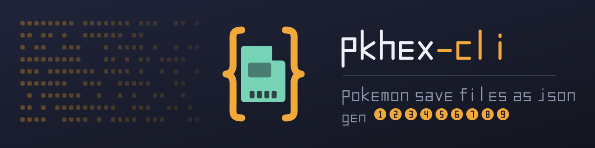

<p align="center">
  
</p>

<p align="center">
  <a href="https://github.com/YourBr0ther/pkhex-cli/actions/workflows/ci.yml"></a>
  
  
  
</p>

Convert Pokémon save files and individual Pokémon to JSON, edit the JSON, and
write valid game files back. A Python port of the file-format layer of
[PKHeX](https://github.com/kwsch/PKHeX), covering all nine generations with no
runtime dependencies.

```console
$ pkhexpy show ~/saves/violet/main
Game       Scarlet/Violet (generation 9)
Trainer    Chris [51328/59716]
Money      2434
Play time  5h 22m 8s
Checksums  valid

Party (5)
  1. Clodsire lv20
  2. Fuecoco lv15 *shiny*
  3. Lechonk lv15
```

## Install

```sh
pip install git+https://github.com/YourBr0ther/pkhex-cli.git
```

Requires Python 3.10 or newer. Not on PyPI yet; see
[CHANGELOG.md](CHANGELOG.md) for what has landed since the last tag. The repository is `pkhex-cli`; the package it
installs and the command it provides are both named `pkhexpy`.

## Usage

```sh
pkhexpy show <file>               # summary of a save or a .pkX
pkhexpy boxes <save>              # every Pokémon in a save, one per line
pkhexpy to-json <file> [-o out]   # file to JSON, stdout if no -o
pkhexpy from-json <json> [-o out] # JSON back to a game file
pkhexpy formats                   # supported formats
```

`show` and `to-json` detect the file type themselves. Saves are matched on size
and a structural check; entity files fall back to their extension when two
formats share a length.

### Editing a save

```sh
pkhexpy to-json ~/saves/violet/main -o violet.json
$EDITOR violet.json
pkhexpy from-json violet.json -o edited.main
```

Renaming one Pokémon changes 37 bytes of a 3 MB save and leaves every checksum
valid.

### Options

| Flag | Effect |
| --- | --- |
| `--no-raw` | Omit the embedded original bytes. Pair with `--into <original>` on import. |
| `--into <file>` | Supply the original save so a `--no-raw` document round trips exactly. |
| `--party-only` | Skip the boxes. |
| `--indent -1` | Single-line JSON. |
| `--encrypted` | Write a .pkX in the form a save stores, not the decrypted form. |

## Library

```python
from pkhexpy import saves

sav = saves.read_file("main")
print(sav.trainer_name, sav.money, sav.checksums_valid)

sav.trainer_name = "Ash"
sav.money = 999999

for box, slot, pk in sav.iter_boxes():
    print(box, slot, pk.species_name, pk.current_level, pk.is_shiny)

pk = sav.get_box_slot(0, 0)
pk.nickname = "Bulby"
pk.ivs = (31, 31, 31, 31, 31, 31)
sav.set_box_slot(0, 0, pk)
open("edited.main", "wb").write(sav.to_bytes())   # checksums recomputed
```

```python
from pkhexpy.pkm import io, serialize

entity = io.read_file("pikachu.pk9")
document = serialize.to_dict(entity)
document["fields"]["EV_HP"] = 252
io.write_file("edited.pk9", serialize.from_dict(document))
```

## JSON schema

| Key | Contents |
| --- | --- |
| `fields` | Every byte-addressed field, keyed by its PKHeX property name. Editing these changes the bytes. |
| `derived` | Read-only context: names, level, shininess, met location. Ignored on import. |
| `raw_base64` | The original buffer. Import starts from it and applies only changed fields, so trash bytes survive. |

```json
{
  "schema": "pkhexpy/entity/1",
  "format": "PK9",
  "generation": 9,
  "checksum_valid": true,
  "fields": { "Species": 89, "Nickname": "Muk", "EV_HP": 0, "IV_ATK": 27 },
  "derived": {
    "SpeciesName": "Muk",
    "Level": 20,
    "IsShiny": true,
    "BaseStats": [105, 105, 75, 50, 65, 100],
    "CalculatedStats": [77, 52, 40, 30, 36, 50],
    "MoveNames": ["Minimize", "Disable", "Acid Spray", "Poison Fang"],
    "MetLocationName": "Pokémon GO"
  },
  "raw_base64": "..."
}
```

A save document wraps entity documents in `party`, `boxes` and `extra`,
alongside `trainer` and the save's own `raw_base64`.

`extra` is everything the games keep outside the party and the boxes, which is
easy to lose track of and easy to leave out. Depending on the generation that
means the daycare, a Battle Box team, Poké Pelago, the Grand Underground's
encounter cache, a GTS or Global Link upload, a staged gift, a Surprise Trade
in transit, the ride legendary, and the Pokémon fused into Kyurem, Necrozma or
Calyrex. That last group matters most: fuse a legendary and its other half
exists nowhere else in the file.

Names resolve in ten languages, selected by each Pokémon's stored language.
Generations 1 to 4 use per-language glyph tables rather than Unicode, so writing
a name the target encoding cannot represent raises an error rather than storing
a truncated one.

## Supported formats

| Gen | Saves | Individual Pokémon |
| --- | --- | --- |
| 1 | Red/Blue/Yellow | PK1 |
| 2 | Gold/Silver/Crystal | PK2, SK2 |
| 3 | Ruby/Sapphire, Emerald, FireRed/LeafGreen | PK3, CK3, XK3 |
| 4 | Diamond/Pearl, Platinum, HeartGold/SoulSilver | PK4, BK4, RK4 |
| 5 | Black/White, Black 2/White 2 | PK5 |
| 6 | X/Y, Omega Ruby/Alpha Sapphire | PK6 |
| 7 | Sun/Moon, Ultra Sun/Ultra Moon, Let's Go | PK7, PB7 |
| 8 | Sword/Shield, Brilliant Diamond/Shining Pearl, Legends Arceus | PK8, PB8, PA8 |
| 9 | Scarlet/Violet, Legends Z-A | PK9, PA9 |

Also handles Japanese and Korean releases, half-size GBA saves, and emulator
saves with a trailing real-time-clock footer, which it preserves on write.

## Verification

These numbers come from files this project did not generate.

| | Result |
| --- | --- |
| PKHeX .pkX fixtures | 207/207 byte-exact, binary and JSON |
| Real save files | 60/60 byte-exact, binary and JSON |
| Games covered | 20, across all nine generations |
| Pokémon read | 18,513 in boxes and parties, plus 141 stored elsewhere |

PKHeX names its fixtures `{Species}{-Form}{★} - {Nickname} - {Checksum}{EncryptionConstant}`,
so each filename independently states six values. All 207 agree on every one.

The suite also range-checks every field of all 18,513 Pokémon, asserts that
fields expected to vary are not stuck on one value, and confirms each level
matches the experience stored beside it.

One check covers several offsets at once. Recomputing a party Pokémon's battle
stats needs its base stats, IVs, EVs, level and nature to all be read
correctly, and the game stores the answer next to them. 241 of 253 party
Pokémon match exactly.

The twelve that differ are the games working as designed. Stats are recomputed
only on level-up, so EVs earned since the last one have not been applied yet.
Feeding the earlier value back in reproduces all twelve exactly. The JSON
reports both numbers, as `CalculatedStats` and `StoredStats`.

Legends Z-A has no public save dump. Its geometry runs only against a
constructed save, so treat it as unverified.

## Limitations

- Writing an edited 3DS save back to hardware needs a MemeCrypto signature,
  which is not implemented. Existing signatures are left intact, so unedited
  files round trip exactly and emulators load edited ones.
- No legality checking. PKHeX will tell you a Pokémon could never have existed;
  this reads and writes what the bytes say.
- Save formats not covered: Colosseum, XD, Ruby/Sapphire Box, Battle
  Revolution, Ranch, Stadium, the Omega Ruby/Alpha Sapphire demo, GameCube
  memory-card containers, and the Pokémon Bank and Pokéstock bulk binaries.
  Handed one, `pkhexpy` names the format and says it is out of scope rather
  than reporting the file as unrecognizable. The Pokémon formats from those
  games do work as individual files.
- Rejects console-encrypted or container-wrapped dumps with a message rather
  than parsing them into nonsense.

## Development

```sh
python3 -m pytest tests/ -q          # 59 tests on a bare clone

git clone --depth 1 https://github.com/kwsch/PKHeX.git reference_PKHeX
python3 -m pytest tests/ -q          # 88, with the .pkX fixtures

sh tools/fetch_test_saves.sh         # ~40 MB of real saves
python3 -m pytest tests/ -q          # 120, with the save corpus
```

`PKHEX_REFERENCE` and `PKHEXPY_SAVES` relocate those two directories.

### Generated code

`src/pkhexpy/pkm/_layouts.py`, `src/pkhexpy/strings/tables.py` and everything
under `src/pkhexpy/data/` are generated from the PKHeX sources and must not be
edited by hand. `tools/extract_fields.py` parses PKHeX's C# property
definitions into 2,728 field descriptors, reporting any property it cannot
translate rather than dropping it. See [CLAUDE.md](CLAUDE.md) for the regeneration
commands and the invariants to preserve.

The save corpus comes from four public collections, none of it vendored:
[pksav-test-saves](https://github.com/ncorgan/pksav-test-saves),
[RoCs-PC](https://github.com/ReignOfComputer/RoCs-PC),
[NX_Saves](https://github.com/Viren070/NX_Saves) and
[Pokemon-Home-and-Save-File-Backups](https://github.com/SHRetro/Pokemon-Home-and-Save-File-Backups).

## License

AGPL-3.0. Every byte offset, checksum and encryption routine here comes from
[PKHeX](https://github.com/kwsch/PKHeX) by Kurt (kwsch), which is AGPL-3.0, so
this port is too. See [LICENSE](LICENSE).

Pokémon is a trademark of Nintendo, Creatures Inc. and GAME FREAK Inc. This
project is not affiliated with them or with PKHeX.
